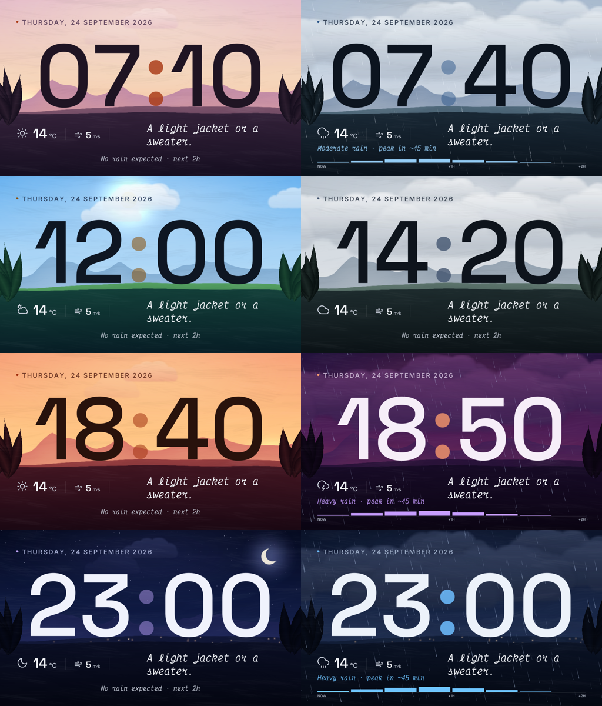

# Prerequisites

```sh
sudo apt-get install build-essential git make \
pkg-config cmake ninja-build gnome-desktop-testing libasound2-dev libpulse-dev \
libaudio-dev libfribidi-dev libjack-dev libsndio-dev libx11-dev libxext-dev \
libxrandr-dev libxcursor-dev libxfixes-dev libxi-dev libxss-dev libxtst-dev \
libxkbcommon-dev libdrm-dev libgbm-dev libgl1-mesa-dev libgles2-mesa-dev \
libegl1-mesa-dev libdbus-1-dev libibus-1.0-dev libudev-dev libthai-dev \
libpipewire-0.3-dev libwayland-dev libdecor-0-dev liburing-dev libharfbuzz-dev \
libcurl4-openssl-dev
```

# Environment Variables

Set the `GROQ_API_KEY` environment variable to your Groq API key if you want to get clothing advice from the Groq API.

# Building

Run `cmake --preset release` to generate the build system and `cmake --build --preset release` to build the project.

To build debug version, run `cmake --preset debug` and then `cmake --build --preset debug`.

# Building for Raspberry Pi

## Preparing cross-compilation environment

```sh
sudo apt install rsync symlinks gcc-arm-linux-gnueabihf g++-arm-linux-gnueabihf
```

Set up `libcurl` with openSSL support on your Raspberry Pi (cpr is gonna link against it).

You need to setup `./pi_sysroot` folder. Connect your RPi SD card to your computer and mount it.
And no, you can't just copy the files from the SD card img file you downloaded from the Raspberry Pi website.
You need the actual files from the SD card you're running on. _Alternatively, you can run `./pi_sysroot.sh <username> <hostname>` to
do the below over the network (make sure you have `rsync` installed),_ but plugging in the SD card and mounting it is sometimes faster.

Then run while being inside `/` on the `rootfs` partition (replace `~/clock_v3_cpp/pi_sysroot` with the actual path):

```sh
rsync -avz --rsync-path="sudo rsync" ./lib ~/clock_v3_cpp/pi_sysroot/
rsync -avz --rsync-path="sudo rsync" ./usr/lib ~/clock_v3_cpp/pi_sysroot/usr/
rsync -avz --rsync-path="sudo rsync" ./usr/include ~/clock_v3_cpp/pi_sysroot/usr/
```

then use `sudo symlinks -rc ~/clock_v3_cpp/pi_sysroot` to fix symlinks.

## Cross-compiling

```sh
cmake --preset release-arm
cmake --build --preset release-arm
```

Then copy the binary to the Raspberry Pi:

```sh
scp build/release-arm/digital_clock_v3 <username>@<hostname>:~
```

Alternatively, you can run `./deploy.sh <username> <hostname>` to copy the binary and restart the service on the Raspberry Pi.

## Autostart

```bash
sudo vim /etc/systemd/system/digital-clock.service
```

`digital-clock.service`:

```
[Unit]
Description=Digital Clock Service
After=network.target

[Service]
Type=simple
User=n
WorkingDirectory=/home/n
ExecStart=/home/n/digital_clock_v3
Restart=always
RestartSec=3

[Install]
WantedBy=multi-user.target
```

```bash
sudo systemctl enable digital-clock.service
sudo systemctl start digital-clock.service
```

# Attribution

- BellotaText Bold font used in this project is licensed under the [Open Font License](https://openfontlicense.org).
